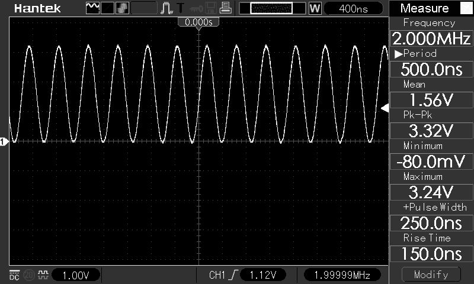

# DSO5102P-Python
 Access to the Hantek DSO5102P oscilloscope from Python

See this sites for details:
* https://elinux.org/Das_Oszi_Protocol
* https://randomprojects.org/wiki/Voltcraft_DSO-3062C

My Hantek DSO5102P reports VID:PID as 049f:505a so I added ``/etc/udev/rules.d/99-dso5102P.rules``

	SUBSYSTEM=="usb", ENV{DEVTYPE}=="usb_device", ATTR{idVendor}=="049f", ATTR{idProduct}=="505a", MODE="0666"

and reload udev rules with

	sudo udevadm control --reload-rules

Implemented and tested functions:
* Echo: send data bytes a returned unchanged
* ReadFile: read any file from the DSO filesystem
* LockControlPanel: lock/unlock DSO control panel
* StartAcquisition: start/stop acquisition in the DSO
* KeyTrigger: lets you simulate the press of nearly any button on the DSO's control panel.
* Screenshot: get a screenshot from the DSO (no color palette information)
* ReadSystemTime: read the DSO's system time
* RemoteShell: run shell commands in the DSO

Implemented amd not tested functions:
* ReadSettings: read current DSO settings
* ReadSampleData: read sample data from the DSO CH1/CH2
